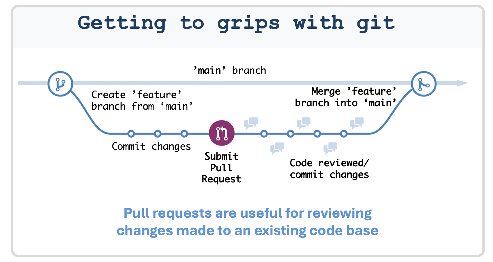

# Materials for Code Review in Academia Workshop 

This workshop will start with an introductory presentation on conducting effective code reviews in academia. We'll cover how to prepare code for review and the key aspects to focus on when evaluating code. After the presentation, there will be a tea/coffee break, followed by a hands-on session where participants will work in pairs/small groups to review various snippets of R or Python code, putting the concepts learnt from the introductory presentation into practice.

## Agenda
* Tuesday 12th May 2026
* Olga Polcock Room, Lady Margaret Hall, University of Oxford

| Time               | Session                                                                 |
|--------------------|------------------------------------------------------------------------|
| 9:45am - 10:00am  | Registration                                                           |
| 10:00am - 11:00am | Introduction Presentation [Download links for [pdf](https://raw.githubusercontent.com/EleanorSC/getting-to-grips-with-git/main/getting_to_grips_with_git.pdf)]|
| 11:00am - 11:30am | Break (free tea/coffee/snacks available)                               |
| 11:30am - 12:30pm | [Practical Session](practical_session)                                |

:exclamation: **Please add comments and questions to this [padlet](https://tinyurl.com/code-review-padlet) throughout the workshop** :exclamation:

## Useful resources

- **git and github:**
  - [Explanation about git and GitHub](https://docs.github.com/en/get-started/using-git/about-git)
  - [Using git on the command line](https://git-scm.com/book/en/v2/Getting-Started-The-Command-Line)
  - [GitHub documentation pages](https://docs.github.com/en)
  - [A game to learn about git branches](https://learngitbranching.js.org/)

- **[Oxford Code Review Network](https://github.com/OxfordCodeReviewNet/forum)**

___

